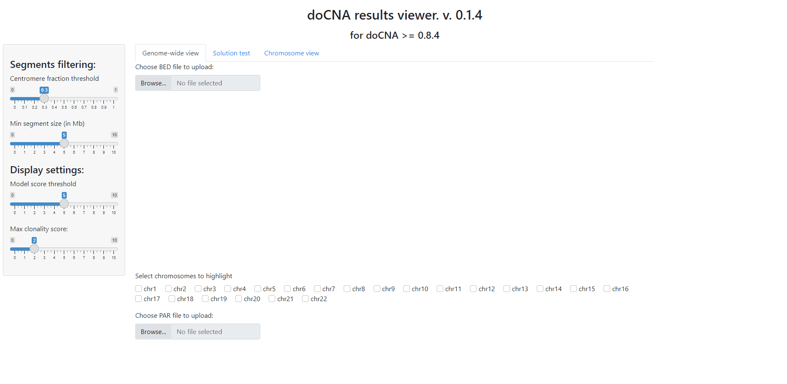

# doCNA

Tool for analysis of copy number profile in WGS.

## Installing doCNA

```shell
git clone https://github.com/stjude/doCNA.git

# setup a virtual environment
python -m venv docna_install
source ./docna_install/bin/activate

# install into virtual environment
pip3 install ./doCNA
```

## Workflow for running doCNA

1. Get a local copy of the config:
```shell
docna getconfig
```

2. Edit the config to point to real SuperGood and CytoBand files. We don't recommend changing additional parameters when starting out.

3. Run doCNA to generate output files:
```shell
# replace sample with whatever your samplename is

docna analyze -i Sample.txt -c doCNA.ini -s Sample
... Lots of log info! ...
12:18:19 doCNA.WGS: INFO: Ready to report!
All done
```

4. Launch the viewer and visualize output:
```shell
docna viewer
**********
Access dashboard in browser via: http://10.220.16.129:39738
**********
INFO:     Started server process [11716]
INFO:     Waiting for application startup.
INFO:     Application startup complete.
INFO:     Uvicorn running on http://10.220.16.129:39738 (Press CTRL+C to quit)
```
5. Load files:

